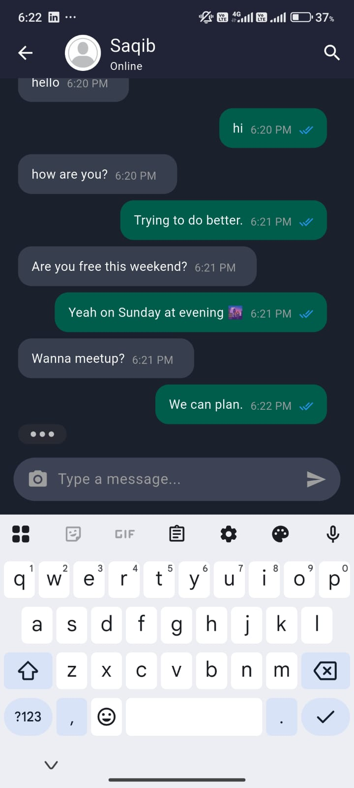
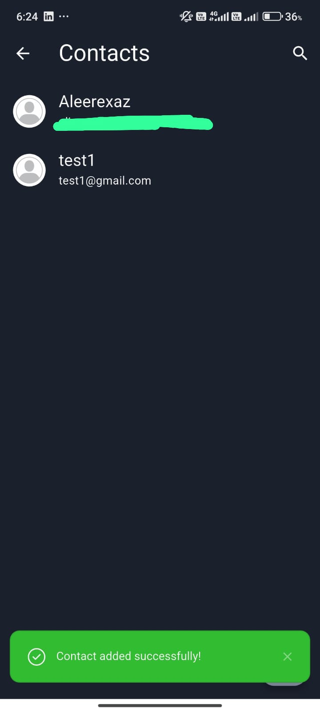
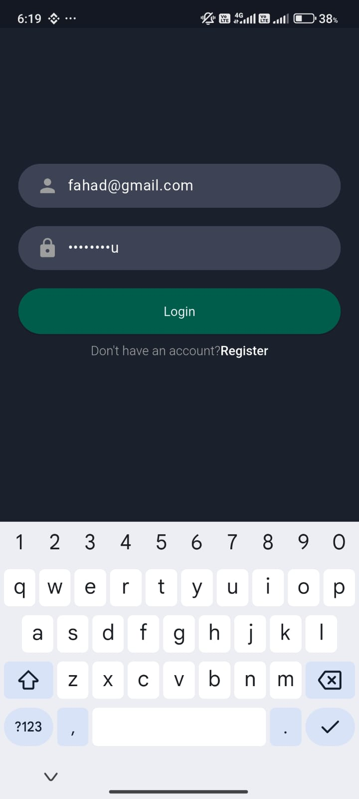

# Realtime Chat App 💬

A seamless and modern chat application built using Flutter and Node.js with socket.io. This app enables real-time messaging, contact management, and user authentication – all wrapped in a smooth and intuitive interface.

## Table of Contents

* [Screenshots](#screenshots)
* [Features](#features)
* [Setup](#setup)
* [Usage](#usage)
* [Technology Used](#technology-used)
* [Author](#author)

---

## Screenshots

Chat Screen


Contacts List


Login / Register


---

## Features

* **Authentication**: Register, login, and logout users with secure token-based authentication.
* **Contacts Management**: Add, manage, and chat with saved contacts.
* **Real-time Messaging**: Chat in real-time using socket.io.
* **Beautiful UI**: Clean and modern user interface designed with Flutter.
* **Toast & Error Handling**: Displays toast notifications for success and errors.

---

## Setup

### Step 1: Install Prerequisites

Make sure you have the following installed:

* **Node.js**: [Download here](https://nodejs.org/)
* **Flutter**: [Install Flutter](https://docs.flutter.dev/get-started/install)
* **Firebase CLI** (Optional): [Install here](https://firebase.google.com/docs/cli)

---

## Backend Setup

### Step 2: Configure Environment

Create a `.env` file in the root of your backend with the following variables:

```bash
DB_PORT=
DB_HOST=
DB_NAME=
DB_PASSWORD=
DB_USER=
FIREBASE_SERVICE_ACCOUNT_BASE64=
JWT_SECRET=
JWT_REFRESH_SECRET=
```

### Step 3: Install Node Modules

```bash
npm install
```

### Step 4: Setup Firebase Service Account

1. Create a Firebase project.
2. Go to **Project Settings > Service Accounts**.
3. Download the `serviceAccountKey.json`.
4. Convert it to base64 using this command:

```bash
base64 serviceAccountKey.json
```

5. Paste the output into your `.env` file under `FIREBASE_SERVICE_ACCOUNT_BASE64`.

### Step 5: Start the Backend Server

```bash
npm run dev
```

---

## Frontend Setup

### Step 6: Configure Constants

Open `/lib/core/constants.dart` and update:

```dart
static final String baseUrl = "YOUR_BACKEND_URL";
static final String socketUrl = "YOUR_SOCKET_URL";
```

Use `localhost` only when both server and app are on the same machine. Otherwise, use your local IP or deployed server URL.

### Step 7: Add Firebase Config

Download the `google-services.json` from your Firebase project and place it inside:

```
android/app/
```

### Step 8: Run Flutter App

```bash
flutter pub get
flutter run
```

---

## Usage

1. Register or Login using email and password.
2. Add a contact by email.
3. Start chatting in real-time! 🎉
4. Get instant feedback with toast notifications.

---

## Technology Used

* [Flutter](https://flutter.dev/)
* [Node.js](https://nodejs.org/)
* [Socket.io](https://socket.io/)
* [Firebase Admin SDK](https://firebase.google.com/docs/admin/setup)
* [MongoDB](https://www.mongodb.com/)
* [toastification (Flutter)](https://pub.dev/packages/toastification)

---

## Author

This chat application was developed by **Fahad Ali**.
Feel free to fork, contribute, or connect!

[](https://www.linkedin.com/in/fahad-ali-122b39302/)
[](https://github.com/fahad7169)

---
